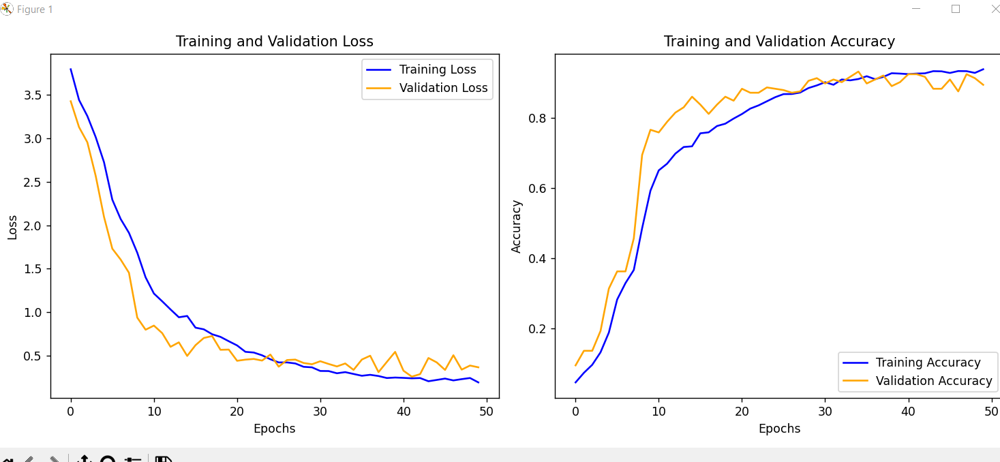
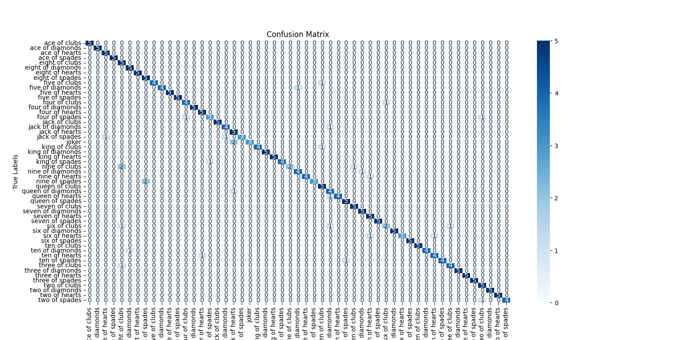
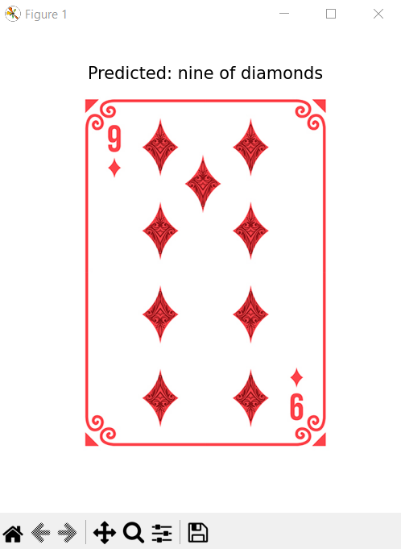

#### Image Classification With Pytorch

This deep learning project focuses on classifying images of playing cards, utilizing the PyTorch library. The chosen model architecture for this project is AlexNet (built from scratch, not using transfer learning).

**Training Details** :

* **Epochs** : 50
* **Batch Size** : 8

* **Learning Rate** : 0.0005, optimized using the Adam optimizer with a weight decay of `1e-4`.

**Data Preprocessing** :

* Images were resized to **227x227 pixels** as the sole transformation; no data augmentation techniques (e.g., flipping or rotation) were used.

**Validation Methods** :

* Validation was performed with Holdout-Validation Method at the end of each epoch using the **validation dataset** to calculate loss and accuracy.
* It employs a **simple train-validation split** where the training and validation sets are predefined and separate. The training loop iterates through the `train_loader`, and after each epoch, the model is evaluated on the `valid_loader` to measure validation loss and accuracy.

### Results:

**Training results:**

**Testing results:**

Test Accuracy: 0.8830
Classification Report:
                          precision   recall   f1-score   support

    accuracy                                         0.88       265
    macro avg            0.91      0.88      0.88       265
    weighted avg       0.91      0.88      0.88       265

Confusion Matrix 

**Custom Image Test Result:**

